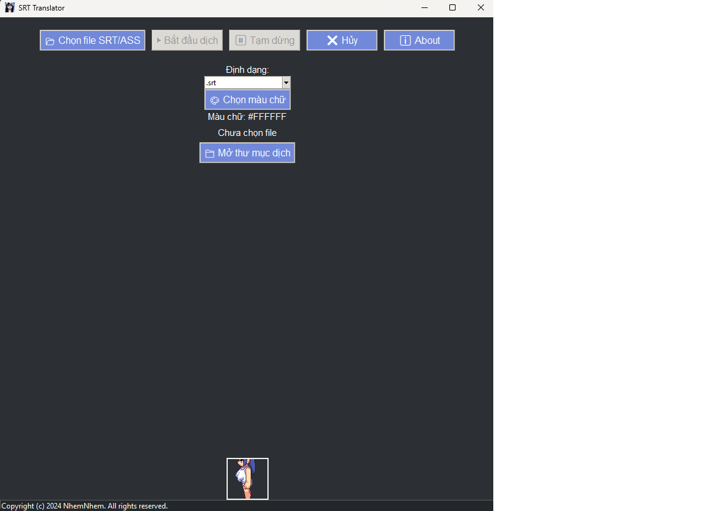

# Translator SRT Tool

## 📌 Mô tả

**Translator SRT Tool** là một công cụ giúp dịch file phụ đề `.srt` và `.ass` từ tiếng Anh sang tiếng Việt bằng Google Translate API. Công cụ hỗ trợ tự động hóa việc dịch nhanh chóng, giúp tiết kiệm thời gian chỉnh sửa phụ đề.

## 🎯 Tính năng chính

✅ Hỗ trợ dịch file phụ đề `.srt` và `.ass`  
✅ Giao diện thân thiện, dễ sử dụng  
✅ Cho phép chọn màu chữ khi xuất file  
✅ Chức năng tạm dừng và tiếp tục dịch  
✅ Hiển thị tiến trình dịch với thanh trạng thái  
✅ Hỗ trợ nhiều file cùng lúc  
✅ Tự động lưu file dịch với định dạng chuẩn

## 📦 Cài đặt

Yêu cầu Python 3.x trước khi cài đặt.

1. Clone hoặc tải về repository:
   ```sh
   git clone https://github.com/nhemnhem/translator-srt-tool.git
   cd translator-srt-tool
   ```

2. Cài đặt các thư viện cần thiết:
   ```sh
   pip install -r requirements.txt
   ```

3. Chạy chương trình:
   ```sh
   python translator_srt.py
   ```

## 🛠️ Cách sử dụng

1. Mở ứng dụng.
2. Chọn file phụ đề cần dịch (`.srt` hoặc `.ass`).
3. Chọn định dạng xuất file.
4. Chọn màu chữ (tùy chọn).
5. Nhấn **Bắt đầu dịch** để khởi động quá trình.
6. Chờ hoàn tất, sau đó mở file dịch để kiểm tra kết quả.

## 📦 Release

Bạn có thể tải phiên bản mới nhất của ứng dụng tại:  
👉 [Tải xuống](https://github.com/NhomNhem/TranslatorSrtTool/releases)

## 🖼️ Ảnh minh họa


## 📜 Bản quyền

© 2024 NhemNhem. Mọi quyền được bảo lưu.  
Phát hành theo giấy phép **MIT License**.

## 🤝 Đóng góp

Nếu bạn muốn đóng góp hoặc báo lỗi, vui lòng mở một issue hoặc tạo pull request trên GitHub.

**Contributors:**

<a href="https://github.com/NhomNhem/TranslatorSrtTool/graphs/contributors">
  
</a>


## 📞 Liên hệ

- **Email:** truongduy18.03.03al@gmail.com
- **Website:** [https://nhomtoongtenz.io.vn](https://nhomtoongtenz.io.vn)

Cảm ơn bạn đã sử dụng Translator SRT Tool! 🚀

